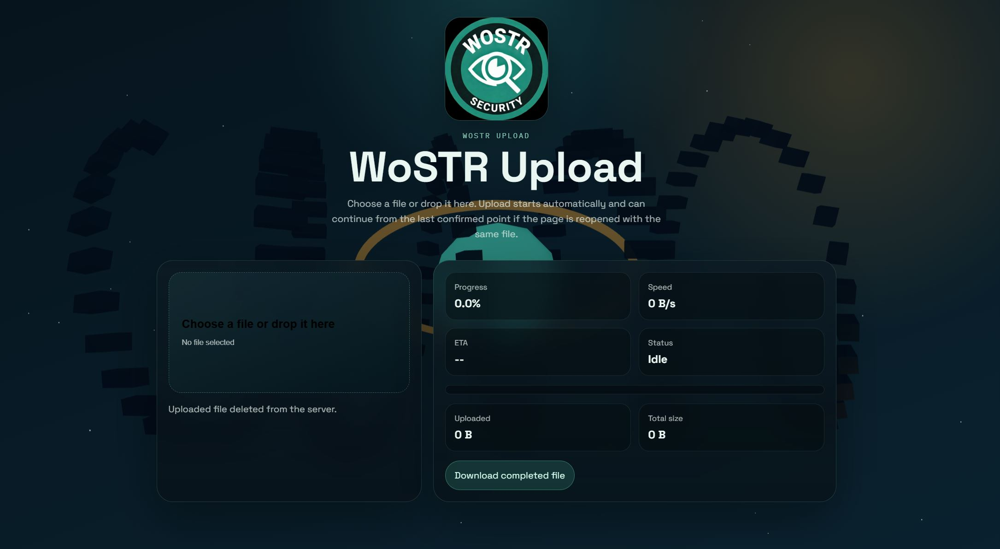

# WoSTR Upload

Resumable large-file uploader with a Bun backend and a branded browser UI.



## What it does

- Streams file parts directly to disk without buffering the whole file in memory.
- Supports resumable uploads up to 100GB.
- Tracks per-part SHA-256 checksums.
- Starts upload automatically after file selection or drag-and-drop.
- Lets the user cancel an in-progress upload or delete a completed file from the UI.
- Serves completed files back from the same server.

## Run it

```powershell
bun run server.js
```

The app listens on [http://localhost:8080](http://localhost:8080).

## Project files

- `server.js`: Bun HTTP server, resumable upload API, static file serving
- `public/index.html`: branded upload page
- `public/app.js`: upload client, status updates, cancel/delete actions
- `public/visualizer.js`: visual background layer
- `public/assets/wostr-sec.jpg`: WoSTR brand image
- `data/uploads/`: temporary session metadata and partial uploads
- `data/final/`: finalized uploaded files

## Storage layout

- Partial upload metadata: `data/uploads/<upload-id>.json`
- Partial upload binary: `data/uploads/<upload-id>.upload`
- Finalized files: `data/final/`

## HTTP API

- `POST /api/uploads` creates a session.
- `GET /api/uploads/:id` reads status for resume.
- `PUT /api/uploads/:id/parts/:partNumber` uploads one binary chunk.
- `POST /api/uploads/:id/complete` finalizes the file once all parts are uploaded.
- `DELETE /api/uploads/:id` deletes the upload session and removes any partial or finalized file.
